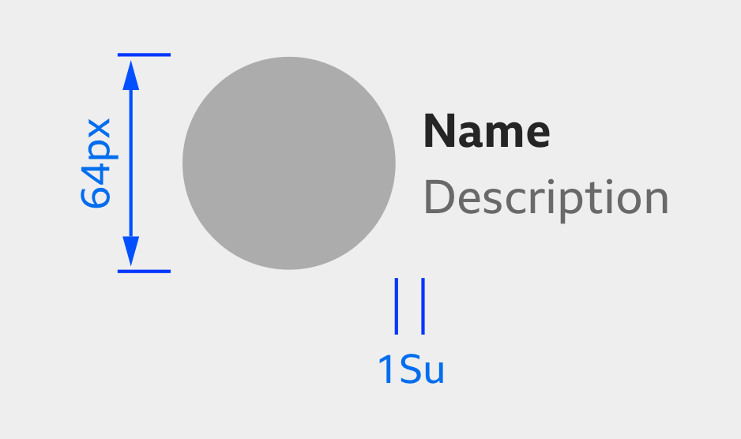

# Contributor

A contributor is used to credit content to a person or an organisation/brand.

### When to use

A contributor should be used to credit content to a person, an organisation or a brand.

### When not to use

A contributor should not be used as a card element.

See related components.

