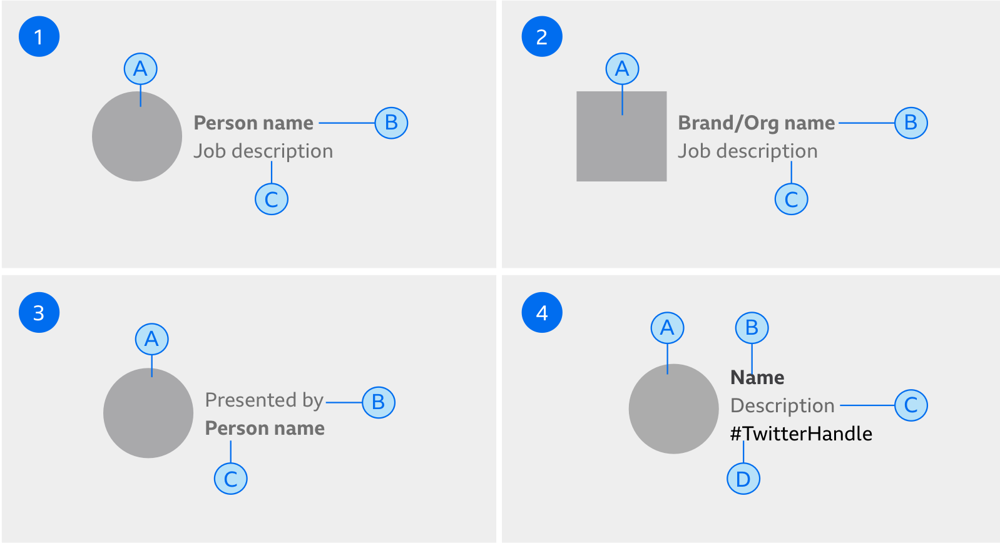
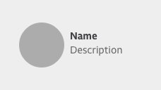
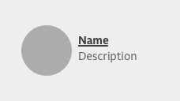
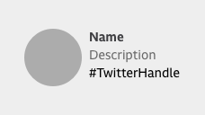
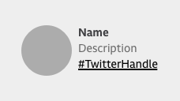

# Contributor

A contributor is used to credit content to a person or an organisation/brand.

### When to use

A contributor should be used to credit content to a person, an organisation or a brand.

### When not to use

A contributor should not be used as a card element.

See related components.

***

## Guideline

### Types

lorem ipsum

#### 1. Person contributor

#### 2. Organisation contributor

### Variants

The format of the contributor is:

1. Name of person or an organisation.
2. Job description.

It’s different when we need to be specific around a contributor’s role in creating the content. In which case it follows the format:

1. Written by/presented by
2. Name of person or organisation

In both cases where the name is a link, this must be displayed in a bold weight.

A default fallback Icon should be used in the scenario when the contributors image cannot be accessed.

Where a person is a contributor the image should be a circle. Where a brand or an organisation is a contributor, the image should be square.

TABLE

***

## Sizes

There are two sizes of the contributor component, small and large.

TABLE

## Alignments

There are four layouts that can be used for the contributor component depending on the type of information we want to display.

TABLE

The text area should be vertically aligned according to the centre of the image.

If the text runs over two lines, the text area should align to the top of the image.

## States

| Default | | |
| ------- |-|-|
|  | **Colour** | **Typography** |

#### Contributor name as link

We can turn the contributors name into a link to move the user on to more content written by the author.

| Default | | |
| ------- |-|-|
|  | **Colour** | **Typography** |

| Hover | | |
| ------- |-|-|
|  | **Colour** | **Typography** |

#### Twitter handle as link
We can add the contributor’s Twitter handle to the configuration.

| Default | | |
| ------- |-|-|
|  | **Colour** | **Typography** |

| hover | | |
| ------- |-|-|
|  | **Colour** | **Typography** |