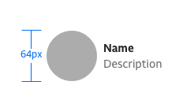
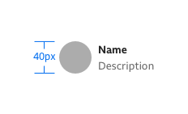
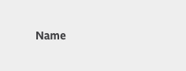
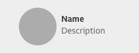
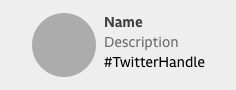

# Contributor

A contributor is used to credit content to a person or an organisation/brand.

### When to use

- A contributor should be used to credit content to a person, an organisation or a brand.

### When not to use

- A contributor should not be used as a card element.

Not the pattern you are looking for? See [related components]().

***

## Guideline

### Types

There are two types of contributor pattern depending on whether the contributor is a person or an organisation.

#### 1. Person contributor

#### 2. Organisation contributor

### Variants

The format of the contributor is:

1. Name of person or an organisation.
2. Job description.

Where the contributor's role in creating the content needs to be specific, the pattern should follow the format:

1. Written by/presented by
2. Name of person or organisation

In both cases where the name is a link the name must be displayed in a bold weight.

A default fallback icon should be used in the scenario when the contributors image cannot be accessed.

Where a person is a contributor the image should be a circle. Where a brand or an organisation is a contributor, the image should be square.

***

## Sizes

There are two sizes of the contributor component; small and large.

| | |
|-|-|
|  | **Large size**   Large size should be used when possible. |
|  | **Small size**   Use the small size when space is limited. |

## Alignments

There are four layouts that can be used for the contributor component depending on the type of information we want to display.

| | |
|-|-|
|  | Name only |
|  | Image + name |
|  | Image + name + description |
|  | Image + name + Twitter handle |

The text area should be vertically aligned according to the centre of the image.

If the text runs over two lines, the text area should align to the top of the image.

## States

| Default | | |
| ------- |-|-|
|  | **Colour** | **Typography** |

#### Contributor name as link

We can turn the contributors name into a link to move the user on to more content written by the author.

| Default | | |
| ------- |-|-|
|  | **Colour** | **Typography** |

| Hover | | |
| ------- |-|-|
|  | **Colour** | **Typography** |

#### Twitter handle as link
We can add the contributor’s Twitter handle to the configuration.

| Default | | |
| ------- |-|-|
|  | **Colour** | **Typography** |

| hover | | |
| ------- |-|-|
|  | **Colour** | **Typography** |

***

## Checklist

| Checklist | Status |
| --------- | ------ |
| Sketch file added | :white_check_mark: |
| Accessibility test conducted | :x: |
| Storybook link available | :white_check_mark: |

***

## Related patterns

- [Inline link]()
- [Promo]()

***

## Research

***

## Changelog

The changelog should use semantic versioning, `major.minor.patch`. Changes should be categorised according to type, `added`, `changed`, `removed`, `fixed`.

| Date | Version no. | Type | Description | Author |
| ---- | ----------- | ---- | ----------- | ------ |
| 17/07/2020 | 2.5.0 | Added | Additions should be labeled `added`, e.g. _Added hover state_. Minor version number should increment by one.| Andrew Nott |
| 15/07/2020 | 2.4.0 | Changed | Changes should be labeled `changed`, e.g. _increased left and right margin by 2px_. Minor version number should increment by one. | Andrew Nott |
| 14/07/2020 | 2.3.0 | Removed | Removals should be labeled `removed`, e.g. *removed unused selected state*. Minor version number should increment by one. | Andrew Nott |
| 13/07/2020 | 2.2.1 | Fixed | Fixes should be labled `fixed`, e.g. _fixed typo_. Patch version number should increment by one. | Andrew Nott |
